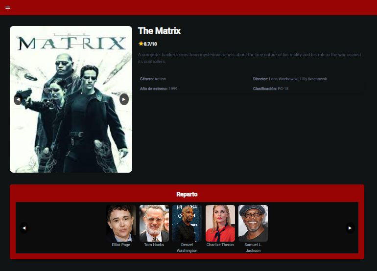
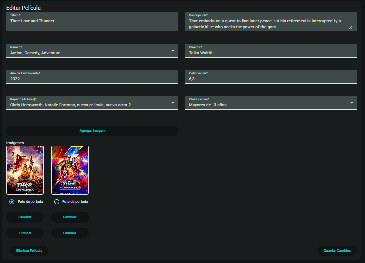
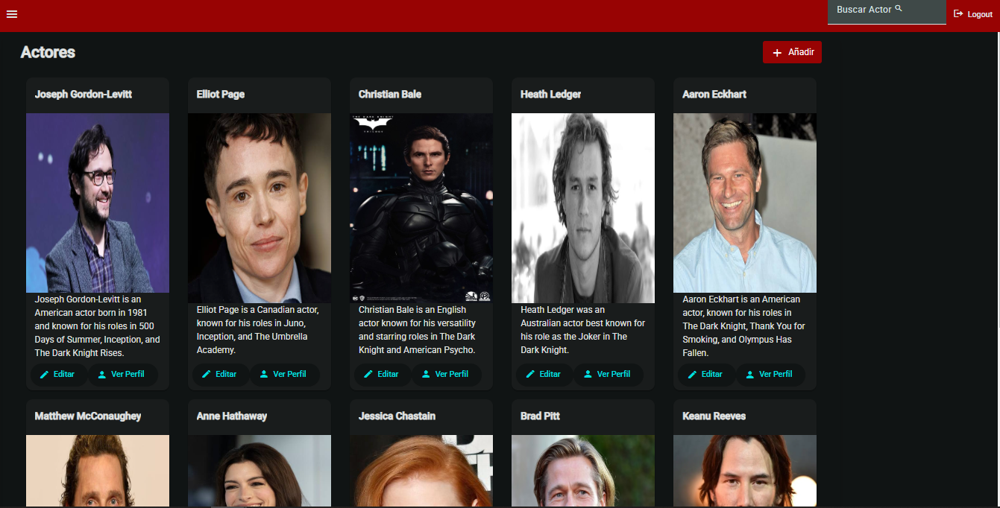
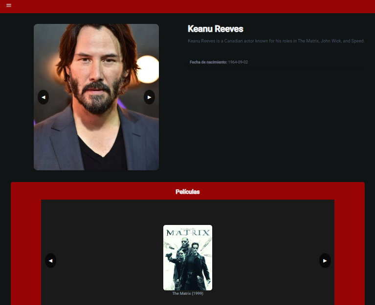
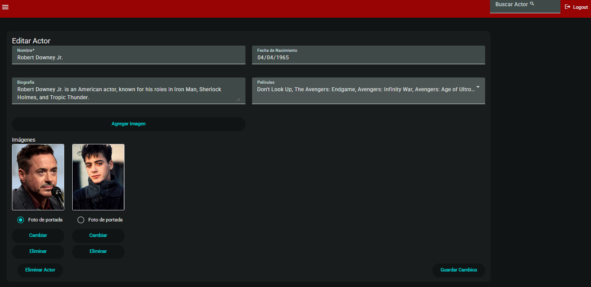

<h1 align="center">
Proyecto Web  IMBD-mini 🎞🎟
</h1>

Realizado por: 👨‍🎓👩‍🎓

<ul >
    <li>Natasha Calderón</li>
    <li>Angélica Díaz</li>
    <li>Wilfredo Villegas</li>
</ul>

-----
## Tabla de contenidos:

- [Contexto de la aplicación](#contexto)
- [Requerimientos funcionales](#requerimientos-funcionales)
- [Requerimiento técnicos](#requerimientos-técnicos)
- [Capturas](#capturas)
    - [Pelicula](#peliculas)
    - [Actor](#actores)

## Contexto:

Crear un sitio web interactivo que permita a los usuarios gestionar información sobre películas, actores y repartos. Los usuarios podrán buscar películas, ver detalles, añadir nuevas películas, editar información existente y eliminar
registros. Este proyecto tiene como objetivo de construir un
sistema web completo utilizando Angular para el frontend, Node.js para el backend y MongoDB (MEAN stack).

## Requerimientos funcionales:

### Gestión de peliculas:

* Crear una página principal que muestre una lista de películas con opciones para buscar, ordenar y filtrar por género, año de lanzamiento y clasificación.

* Permitir agregar nuevas películas con información como título, descripción, género, director, reparto (lista de actores), año de lanzamiento y calificación.

* Permitir la edición de detalles de películas existentes.

* Implementar la funcionalidad para eliminar películas.

* Cada película debe poder subir una o varias imágenes, con una como principal o portada. 
* Visualizar el reparto de cada película en su página de detalles.

### Gestión de actores:

* Crear una página para listar actores con la posibilidad de buscar por nombre.
* Permitir agregar actores con detalles como nombre, fecha de nacimiento y
biografía.
* Los actores deben tener una o más imágenes. Una debe ser la principal.
* Facilitar la edición y eliminación de actores.
* Al consultar actores debe decir las películas que ha participado, con la información básica de la película y la fotografía principal.
* Asociar actores a películas como parte del reparto.

### Autenticación y roles:
* Implementar un sistema de autenticación con registro e inicio de sesión.
* Definir dos roles: Administrador (puede agregar, editar y eliminar registros) y Usuario (solo puede ver la información).

## Requerimientos técnicos:
### Frontend (Angular):
* Implementar navegación con Angular Router.
* Utilizar componentes reutilizables para listas, formularios y tarjetas de información
* Validar formularios en el cliente antes de enviar los datos al backend.

### Backend (Nodejs, Expressjs, MongoDB)
* Validar los datos enviados desde el frontend.!!!!!!!!!
* Definir endpoints para gestionar películas, actores y usuarios (CRUD).
* Utilizar Node.js con Express para crear una API RESTful.
* Diseñar esquemas para películas, actores y usuarios
* Implementar relaciones entre películas y actores.

## Capturas:

### Inicio:

</img>

### Peliculas:
- Mainpage peliculas

- Vista de la pelicula

</img>

- Vista edición

</img>

### Actores:

- Mainpage Actores

</img>

- Vista del actor

</img>

- Vista edición

</img>

